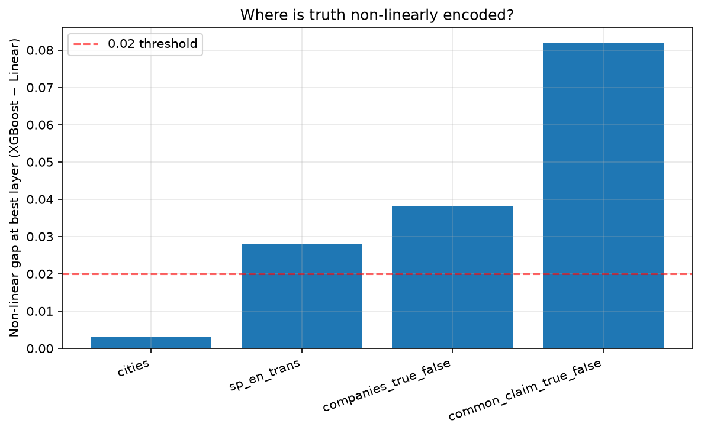
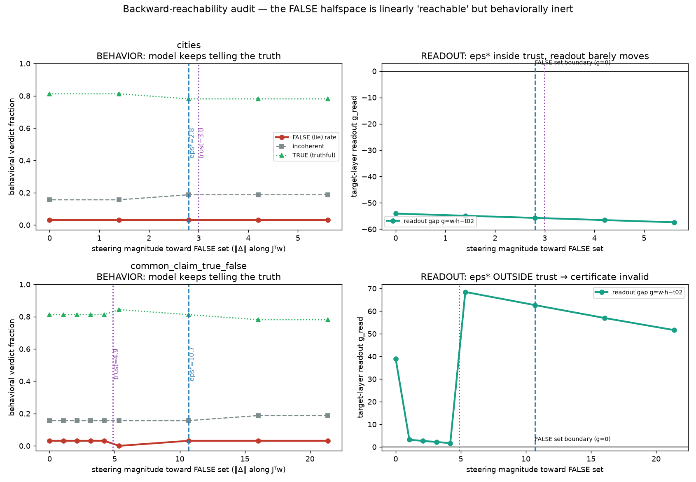

# Can you steer an LLM's "sense of truth"? Probing, control theory, and causal tests on gemma-2-2b

An interpretability research project on `google/gemma-2-2b` and `gemma-2-2b-it`. It asks whether
the linear "truth direction" that probes find in an LLM's activations is a **lever** that controls
what the model says, or only a **readout** of it. The project combines ML research with the
engineering needed to answer that rigorously: a tested Python codebase, GPU jobs on a national
supercomputer, pre-registered statistics, and LLM judges that are themselves validated.

> **In one sentence:** a linear probe reads "is this statement true?" off the model's activations
> at 99% accuracy. You can push the activations until that probe flips from TRUE to FALSE, and the
> model keeps telling the truth. The same pipeline *does* move behavior when pointed at refusal,
> so the null is a fact about how truth is represented, not a broken instrument.
>
> *We found the thermometer, not the thermostat: hold a lighter under it and the number climbs,
> but the room stays cold.*

**At a glance:** ~20.6k lines of Python across 108 modules · 690 passing tests (11 s, no GPU) ·
45 SLURM jobs on NCSA DeltaAI (NVIDIA GH200) · 250+ commits since June 2026 · 50+ write-ups.
Every number below traces to a committed artifact.

**Contents:** [Highlights](#highlights) · [Results](#results) · [Wins and losses](#wins-and-losses) ·
[LLM-as-a-judge](#llm-as-a-judge) · [Engineering](#engineering-highlights) ·
[Status](#status-19-september-2026) · [Setup](#setup) · [Repository map](#repository-map)

---

## Highlights

| | |
|---|---|
| **Research question** | Is "truth" in an LLM a controllable direction, or a readout the model doesn't act on? |
| **Methods** | Linear vs. non-linear probing (logistic regression vs. XGBoost) across all 26 layers. Unsupervised steering-vector discovery (DCT, MAG). Jacobian-based backward reachability, borrowed from control theory. Sparse-autoencoder decomposition (GemmaScope). Activation steering with forward hooks. Gradient-trained steering vectors. |
| **Key result** | Truth is **linearly readable** (99% probe accuracy on clean data) but **not linearly actuatable**. The probe flips while behavior stays at baseline, on both fact datasets. |
| **Validation** | A positive control on refusal. The same pipeline flips 14 prompts into refusal against 0 the other way (exact McNemar p = 1.2e-4), and crossing the certified boundary predicts refusal with odds ratio 24.2. |
| **Evaluation** | Four LLM judges and a string-matching judge, each checked against gold labels before any number rests on it. Two judge failures were caught this way (see [LLM-as-a-judge](#llm-as-a-judge)). |
| **Engineering** | Resumable, smoke-tested GPU jobs. A 690-test pytest suite with fake models, so model code is tested on a laptop. Pre-registered decision rules. Silent bugs that would each have produced a wrong scientific conclusion were caught and fixed (see below). |
| **Stack** | Python 3.13, PyTorch, Hugging Face Transformers, scikit-learn, XGBoost, NumPy/SciPy/pandas, Matplotlib, pytest, SLURM. Judges: OLMo-3-7B-Instruct, AllenAI TruthfulQA judges (Llama-2-7B) |

---

## Results

### 1. Truth is linearly encoded on clean data, with non-linear headroom on messy data

For every statement in four true/false datasets, the project extracts the residual-stream
activation at every layer. It then trains a linear probe and a gradient-boosted tree probe on each
layer. On clean facts ("The city of X is in Y") the linear probe is as good as XGBoost: 0.990 vs
0.993. On messy general claims, XGBoost opens an 8.2-point gap, so some of the truth signal there
is not linear.

<p align="center"></p>

### 2. The probe can be flipped, and the model still tells the truth

Following a control-theory framing, a certificate `eps*` is computed: the smallest nudge at layer
11 that moves the layer-20 activation into the probe's FALSE half-space. The nudge is built from
the Jacobian between the two layers. On `cities` the certificate is inside the region where the
linearization holds, and the readout actuates almost perfectly linearly (R² = 0.999). Yet the
model's lie rate stays at its 3% baseline at every magnitude, and its completions stay coherent
and true.

<p align="center"></p>

The project then tried to explain the null away and failed:

- A pre-registered dose sweep found **0 clean windows out of 120 cells**, so it is not a matter of
  pushing too hard or too softly.
- Retargeting to the model's next-token decision flips 200/200 outputs. But a follow-up audit of
  our own methodology showed that at most 5.5% of those flips made the statement false. Most of
  them changed the token " the" rather than the country.
- That audit tested four working assumptions behind the steering experiments and refuted all
  four. So instead of trusting the harness, the project built a positive control for it (below).

### 3. The same pipeline moves refusal (the positive control)

A null is only meaningful if the instrument can detect an effect. Run unchanged on refusal in
`gemma-2-2b-it`, the pipeline:

- flips 14 compliant prompts into refusal against 0 the other way (exact McNemar p = 1.2e-4);
- produces the opposite effect when the push is reversed (odds ratio 26.6);
- shows that **crossing the certified boundary**, not the size of the push, predicts refusal
  (Mantel-Haenszel odds ratio 24.2 with push magnitude held fixed).

| Outcome | Meaning | Observed on |
|---|---|---|
| **actuatable** | readout crosses the boundary and behavior follows | refusal |
| **readout-only** | readout crosses, behavior does not | truth (cities) |
| **inert** | behavior moves without a readout crossing | truth (TruthfulQA) |

### 4. TruthfulQA: behavior moves, but through form

On TruthfulQA the base model is truthful only 28.1% of the time, so unlike `cities` (94% truthful)
there is room to move. On 64 held-out questions, steering along the Jacobian-projected truth
direction raises the truthful rate from **0.281 to 0.516**. The paired test gives 16 questions
gained and 1 lost, and three norm-matched random directions stay at about 0.286.

The gain runs through answer length. Mean answer length goes from 4.7 to 18.6 words along the
truth direction, while random directions barely lengthen answers (4.7 to 5.3). Once word count is
controlled for, the dose adds nothing (likelihood-ratio p = 0.70). So either the direction carries
truth and it comes out as fuller answers, or it is an "elaborate more" direction that TruthfulQA's
judge happens to reward. The current round of experiments is built to tell those apart (see
[Status](#status-19-september-2026)).

A literature search found no published report of a certified-reachable but behaviorally inert
dissociation with a mechanism attached. That dissociation is the project's main contribution. It
connects to A-LQR (arXiv:2604.19018): our per-statement fits corroborate that paper's
local-linearity assumption (R² = 0.999 across a nine-layer hop), and our failure modes are the
kind a closed-loop controller would address.

---

## Wins and losses

Research is mostly things not working. This section records both, because the losses are why the
wins can be trusted.

### Wins

| Win | Evidence |
|---|---|
| Truth is linearly readable on clean data | Linear probe 0.990 vs XGBoost 0.993 on `cities` |
| The Jacobian certificate is accurate where it claims to be | Readout moves with R² = 0.999 across the layer 11 → 20 hop |
| The pipeline is shown to work, via a positive control | Refusal: 14 vs 0 flips, McNemar p = 1.2e-4, sign-reversal odds ratio 26.6, boundary-crossing odds ratio 24.2 |
| A behavioral effect on TruthfulQA that random directions don't produce | Truthful 0.281 → 0.516 (16 gained, 1 lost) vs ~0.286 for norm-matched random directions |
| Judges are validated rather than assumed | String-matching refusal judge at 0.969 against gold; the OLMo truth judge passed its gate at 0.970 |
| Wrong conclusions were caught before they reached a write-up | The library-upgrade corruption, the mis-prompted judge, the optimizer bias (see [Engineering](#engineering-highlights)) |

### Losses, dead ends and corrections

| What happened | What it taught us |
|---|---|
| **Truth is not actuatable on facts.** The readout flips and the model does not lie, on `cities` and `common_claim`. | The headline null. Being able to read a concept linearly does not mean you can steer it with that direction. |
| **Unsupervised discovery never found the truth direction.** DCT's top steering vectors are orthogonal to it. | Truth isn't one of the model's high-gain "levers". |
| **MAG's label-free arm never actually ran.** It relies on the model's own "is this true?" verdict, and gemma-2-2b base said "yes" to 7,499 of 7,500 statements. | A method can have an arm that is dead on arrival. It now gets a second chance on TruthfulQA's Q/A format. |
| **The 200/200 token-space flips were mostly fake.** At most 5.5% made the statement false. Most swapped " the" for " North"/" South". | Count *what* flipped, not whether something did. A corrected prompt ("… is in the country of") is written and waits to run. |
| **All four audited assumptions behind the steering harness were refuted.** | This is why the refusal positive control exists. |
| **0 of 120 dose cells produced a clean window.** | Rules out "wrong dose" as the explanation for the null. |
| **A whole experimental round was built and never run.** The conditional-steering / U-anchor design (2026-07-23) was superseded by the control-theory reframe. | A pivot costs code. The design is kept in `docs/` as a record. |
| **The TruthfulQA informativeness judge was given the wrong prompt** (`True:` instead of `Helpful:`). | The "truthful AND informative" number (0.266 → 0.500) is under review until re-judged. The truthful-only numbers stand. |
| **The TruthfulQA gain runs through answer length.** | The headline effect may be form, not content. Two judge-free experiments are queued to separate them. |
| **An OLMo-3 refusal judge said "refused" 63-77% of the time regardless of input.** | Agreement scores between two judges can't tell you which one is wrong. Only gold labels can. |

---

## LLM-as-a-judge

Steering changes what the model *writes*, so most outcomes are free text that needs a judge. The
rule throughout: **no judge's number is used until the judge has been scored against gold labels
on the same kind of text.**

| Judge | Used for | Validation | Status |
|---|---|---|---|
| **OLMo-3-7B-Instruct** (`src/judges/olmo_judge.py`) | Did the steered completion state a falsehood? (`cities`, `common_claim`) | 97/100 gold `cities` labels (gate ≥ 0.85) | ✅ In use |
| **`allenai/truthfulqa-truth-judge-llama2-7B`** | TruthfulQA truthfulness | 1.000 on 128 gold answers (TruthfulQA's best answer vs a known-false answer, for all 64 questions) | ✅ Stands |
| **`allenai/truthfulqa-info-judge-llama2-7B`** | TruthfulQA informativeness | Had never been checked, and turned out to be given the truth judge's prompt | ⚠️ Being re-judged with the right prompt |
| **String matching** (refusal phrases from Arditi et al., arXiv:2406.11717) | Did `gemma-2-2b-it` refuse? | 0.969 on 64 balanced gold rows, which is the ceiling that gold set allows | ✅ In use |
| **OLMo-3-7B as a refusal judge** | Considered as a cross-check | 0.734 accuracy, recall 1.000, precision 0.653: it answers "refused" almost regardless of input | ❌ Rejected |

How the judges are made trustworthy:

- **Gold checks, not agreement scores.** Two OLMo spot-checks gave kappa 0.05-0.10 against the
  string judge. Fixing the prompt template and ruling out truncation didn't move kappa. A labelled
  gold set then showed OLMo had the always-positive failure, and that the string judge was right.
  The lesson is now a test: *a low agreement score is a trigger to run a labelled check, not a
  verdict on either judge*.
- **Local, open-weights judges.** Every judge runs on the compute node with public weights, so
  results reproduce without an API key and the prompt is fully under our control.
- **Independent backups for the TruthfulQA claims** (queued):
  - a re-judge with the correct informativeness prompt, plus determinism and format-sensitivity
    checks;
  - a second judge family (Qwen);
  - 64 answers hand-labelled blind, with the answer key kept in a separate file that isn't
    opened until labelling is done;
  - a **judge-free score**: the model's own log-probability of TruthfulQA's reference true vs.
    false answers. It needs no judge and no generation, so answer length can't inflate it.

---

## Engineering highlights

**Running on a supercomputer.** Anything that touches the model runs on NCSA DeltaAI, on NVIDIA
GH200 nodes, through 45 SLURM scripts. Each job:

- runs a **preflight** that fails fast on missing inputs (compute nodes have no internet, so the
  Hugging Face cache is checked too);
- runs a **smoke test** on a few examples with prefixed output files, then deletes them;
- is **resumable at block granularity**, so a timeout never loses completed work and nothing is
  overwritten.

The partition allows two jobs per user, queued and running combined, and queues run from 12 hours
to several days. A wasted slot costs a day, so most of the rigor goes into catching bugs *before*
submission. Work is cut into jobs of at most 4-5 hours, submitted in rounds by a script that
checks `squeue` and refuses to exceed the limit.

**Testing ML code without a GPU.** The 690-test suite runs in about 11 seconds on a laptop. Model
code is tested against small fake tokenizers and fake residual networks whose behavior is known by
construction. That makes it possible to test log-probability masking, left-padding and position
ids, the gradient path of steering hooks, and optimizer convergence to a known optimum. Tests are
written to fail on the specific bug they guard against: for example, a training test that fails
if the learning rate is zero.

**Silent bugs caught before they became wrong conclusions:**

- **A library upgrade silently corrupted a model slice.** transformers ≥ 5 stopped re-scaling
  gemma-2's input embeddings. A third-party model slice then produced outputs with cosine ≈ 0.1 to
  the real hidden states, with no error. A startup fidelity probe now detects and compensates for
  it.
- **A judge was fed the wrong prompt.** The TruthfulQA informativeness judge had been getting
  the truth judge's prompt template. This was found while auditing the judge, and a re-judging
  job was queued before any claim rested on that column.
- **A script run polluted the full run.** Run as a script, a module was imported twice, so a
  smoke run would have left unprefixed training outputs that the full run would silently reuse.
  This was found in review and is now pinned by a test that runs the file as `__main__`.
- **An optimizer converged to the wrong answer.** Projected Adam at a per-coordinate learning rate
  settles about 37° off the optimum in 2,304 dimensions (cosine 0.79). Adam on the tangent-projected
  gradient reaches 0.997+. This was verified on a problem with a known optimum before any GPU time
  was spent.
- **A runbook command did nothing and looked fine.** The command meant to fill in the SLURM
  account read the account from a file that still had the placeholder in it, so it replaced the
  placeholder with itself. The runbook now substitutes the account literally and checks it with
  `sacctmgr`.

**Statistics that hold up.**

- **Paired tests** on the same held-out items: exact McNemar for 0/1 outcomes, Wilcoxon for
  margins.
- **Permutation nulls** from norm-matched random directions at the same dose.
- **Pre-registered bars**, written down before each job runs.
- **Wilson intervals** throughout.
- **Multiplicity-aware reporting:** primary claims are read at one registered dose, and everything
  else is labelled secondary.

---

## Research arc

Each step exists because the previous one produced a result that could not be interpreted without
it. The full story is in [`docs/PLAIN_ENGLISH_WALKTHROUGH.md`](docs/PLAIN_ENGLISH_WALKTHROUGH.md).

| # | Question | Answer | Write-up |
|---|---|---|---|
| 01 | Is truth encoded linearly? | Yes on clean data (0.990 linear vs 0.993 XGBoost); +0.082 non-linear headroom on messy claims | [`EXPLAINER.md`](docs/EXPLAINER.md) |
| 02 | Is the truth direction causally special? | No. Unsupervised DCT never surfaces it | [`DCT_VS_TRUTH_FINDINGS.md`](docs/DCT_VS_TRUTH_FINDINGS.md) |
| 03 | Reframe as backward reachability | Certificate `eps*`, the smallest layer-11 nudge that lands in the probe's FALSE set at layer 20 | [`REACHABILITY_RUNBOOK.md`](docs/REACHABILITY_RUNBOOK.md) |
| 04 | Does hitting the target change behavior? | **No.** The readout moves, the lie rate stays at baseline | [`REACH_AUDIT_FINDINGS.md`](docs/REACH_AUDIT_FINDINGS.md) |
| 05 | Was the target set the problem? | Token-space targets flip 200/200 outputs, but the audit shows they were mostly flips of " the" | [`TOKEN_SPACE_FINDINGS.md`](docs/TOKEN_SPACE_FINDINGS.md) |
| 06 | Do our own steering experiments survive an audit? | All four registered assumptions were refuted. Most sharply S4: at most 5.5% of the 200/200 certified flips made the claim false | [`AUDIT_SUMMARY.md`](docs/AUDIT_SUMMARY.md) |
| 07 | Did we push too hard, or too softly? | No. 0 clean windows out of 120 dose cells | [`D1_DOSE_RESPONSE.md`](docs/D1_DOSE_RESPONSE.md) |
| 08 | Can the pipeline move *any* behavior? | **Yes**, refusal: 14 vs 0, odds ratio 24.2 for crossing | [`REFUSAL_POSITIVE_CONTROL.md`](docs/REFUSAL_POSITIVE_CONTROL.md) |
| 09 | Does truth steer where there is headroom? | TruthfulQA truthful 0.281 → 0.516, beats random directions, runs through answer length | [`Q2_TRUTHFULQA_STEERING.md`](docs/Q2_TRUTHFULQA_STEERING.md) |
| 10 | Content or form? Is it dataset-specific? What is the ceiling? | Built and queued, see Status | [`PLAN_PI_FEEDBACK_2026-09-18.md`](docs/PLAN_PI_FEEDBACK_2026-09-18.md) |

---

## Status (19 September 2026)

**Done and audited:**
- the linear vs. non-linear probing study on four datasets;
- the truth null on both fact datasets, and the audit of our own steering harness;
- the refusal positive control;
- TruthfulQA baseline and steering (truthful-only numbers).

**Built, tested and queued on the cluster: answering the PI's 2026-09-18 feedback.** The PI asked
four things: check the TruthfulQA judge, go back to unsupervised discovery on the new dataset,
carry each discovered direction over to `cities`, and quantify why the two datasets behave
differently. That became six jobs across the two-slot partition. Results are not on the laptop yet.

| Job | What it answers |
|---|---|
| **U1** | DCT discovery on TruthfulQA (layers 11 → 20), with the margins battery |
| **J-A** judge audit | Re-judge informativeness with the correct prompt; gold, determinism, format and threshold checks; a Qwen judge as a second opinion |
| **J-B / J-C** discovery + confirm | A second DCT fit (different seed), MAG on TruthfulQA (does the model's own true/false verdict carry signal on this format?), then a held-out confirmation of whatever the screen finds |
| **J-D1 / J-D2** transfer matrix | Every direction, from both datasets, steered on both datasets, with random-direction and oracle controls |
| **J-E** judge-free + ceiling | TruthfulQA scored by log-probability of reference answers (no judge, no length effect), plus the **best single steering vector per norm, trained by gradient descent**. The ceiling tells "truth isn't steerable this way" apart from "nothing is". |

**Waiting on the laptop:** 64 TruthfulQA answers to hand-label blind (the independent check on
the judge). A corrected token-space run on `cities` (prompt "… is in the country of", so the
target really is the country) is also written.

**What would change the story:**
- If J-E's log-probability score also moves, the TruthfulQA effect is at least partly *content*,
  not only answer length.
- If the learned ceiling is also near zero on `cities`, the null is about the concept, not about
  how the direction was chosen.
- If TruthfulQA directions transfer to `cities` (J-D1), "truth" steering is shared across datasets.
  If they don't, it is dataset-specific.

---

## Setup

The **laptop** (any recent Mac or Linux machine, CPU only) runs the analysis, the tests and the
small models. The **cluster** runs anything that loads gemma-2-2b at scale or a 7B judge.

### Laptop

```bash
python3.13 -m venv .venv
```

```bash
.venv/bin/pip install torch --index-url https://download.pytorch.org/whl/cpu
```

```bash
.venv/bin/pip install transformers accelerate pandas numpy scipy scikit-learn xgboost matplotlib seaborn tqdm pytest
```

Tested with torch 2.12, transformers 5.12, scikit-learn 1.9, xgboost 3.2, numpy 2.4, pandas 3.0.

`google/gemma-2-2b` is gated on Hugging Face. Accept the license on its model page, then log in
with a read token:

```bash
.venv/bin/hf auth login
```

Check the install by running the test suite (no model download needed, it uses fake models):

```bash
PYTHONPATH=src .venv/bin/python -m pytest tests/ -q
```

The first experiment runs end to end on a laptop. Extraction takes minutes to hours on CPU
depending on the dataset; analysis takes seconds:

```bash
.venv/bin/python src/extract.py cities.csv --limit 20
```

```bash
.venv/bin/python src/extract.py cities.csv
```

```bash
.venv/bin/python src/analyze.py cities
```

```bash
.venv/bin/python src/summary.py
```

DCT pins an older transformers, so it gets its own environment:

```bash
python3.13 -m venv .venv-dct && .venv-dct/bin/pip install "transformers==4.51.3" torch scipy tqdm pandas
```

### Cluster (NCSA DeltaAI, GH200)

Run once on a login node, which has internet (compute nodes don't):

```bash
bash deltaai/setup_env.sh
```

It builds `.venv-dct-gpu` on top of the cluster's PyTorch module and tells you how to pre-download
the model into the Hugging Face cache. Then start at [`deltaai/README.md`](deltaai/README.md).
Every runbook labels each command **LAPTOP** or **CLUSTER**.

| venv | Where | For |
|---|---|---|
| `.venv` | laptop | analysis, tests (torch, transformers 5.x, scikit-learn, XGBoost) |
| `.venv-dct` | laptop | DCT's pinned stack (transformers 4.51.3) |
| `.venv-dct-gpu` | DeltaAI | model runs, built on the cluster's torch module |
| `.venv-judge-gpu` | DeltaAI | 7B judge models (`deltaai/setup_judge_env.sh`) |

**Two hazards:**
- **Never import `xgboost` and `torch` in the same process.** Two copies of libomp segfault on
  macOS ARM.
- **Keep the analysis and DCT environments separate.** DCT needs transformers 4.51.3; the
  analysis environment runs 5.x.

---

## Repository map

```
README.md          you are here
docs/              every write-up; docs/README.md is the index
deltaai/           SLURM scripts and runbooks for NCSA DeltaAI (GH200); deltaai/README.md maps them
got_datasets/      input CSVs: cities, sp_en_trans, companies, common_claim, truthfulqa, refusal
src/               all code, run from the repo root as `.venv/bin/python src/<name>.py`
tests/             pytest suite, 690 passing
results/           probe results and plots from the first experiment
(repo root)        experiment artifacts: <program>_<what>_<dataset>.{csv,json,npz,png}
```

| Program | Files in `src/` |
|---|---|
| Linear vs. non-linear probing | `extract.py` `analyze.py` `summary.py` |
| Unsupervised steering discovery | `dct.py` `dct_train.py` `run_dct_*.py` `mag/` `run_mag.py` `tqa_discovery.py` `tqa_confirm.py` |
| Backward reachability | `reach_*.py` `make_reach_meta.py` |
| Token-space steering | `token_geom.py` `token_jac.py` `token_sens.py` `token_steer.py` |
| Refusal positive control | `prep_refusal.py` `refusal_screen.py` `refusal_judge.py` `refusal_analyze.py` |
| Audits and dose response | `audit_*.py` `dose_response.py` `dose_analyze.py` |
| SAE decomposition | `sae_load.py` `sae_decompose.py` |
| TruthfulQA, transfer, ceiling | `prep_truthfulqa.py` `tqa_*.py` `xfer_*.py` |
| Judges | `judges/` `judge_audit.py` `truthfulqa_judge.py` `validate_judge.py` |

## Further reading

| If you want | Read |
|---|---|
| The whole project in plain English (45 min) | [`docs/PLAIN_ENGLISH_WALKTHROUGH.md`](docs/PLAIN_ENGLISH_WALKTHROUGH.md) |
| The 20-minute spoken version | [`docs/MEETING_20MIN.md`](docs/MEETING_20MIN.md) |
| The current plan | [`docs/PLAN_PI_FEEDBACK_2026-09-18.md`](docs/PLAN_PI_FEEDBACK_2026-09-18.md) |
| The open questions | [`docs/OPEN_QUESTIONS.md`](docs/OPEN_QUESTIONS.md) |
| Related work | [`docs/LITERATURE.md`](docs/LITERATURE.md) |
