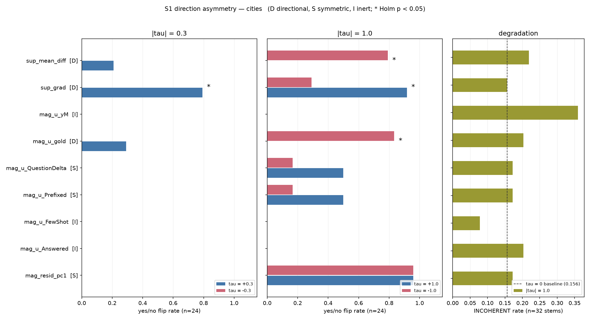
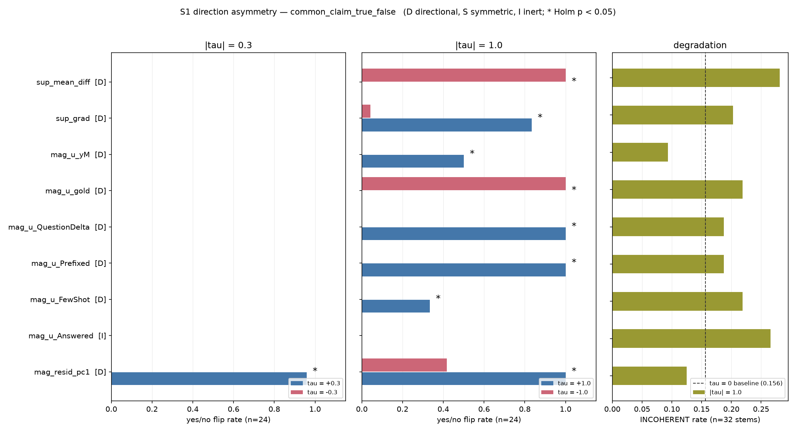

# S1: Direction Asymmetry Audit

**Status:** complete, 2026-08-26. CPU only, no artifact re-run.
**Design:** section 3 of `docs/superpowers/specs/2026-08-26-steering-validity-audit-design.md`.

---

## 1. Assumption

Behavioral flips attributed to steering are **directional** effects of a truth-carrying vector,
not **magnitude** effects of an arbitrary perturbation of that size.

This is falsifiable: if a direction produces the same flip rate at `+tau` and `-tau`, negating
the supposed "more true" vector does not reverse the behavior, and the effect cannot be
carrying a signed concept. It is then a perturbation, not a steering vector.

## 2. Prediction, registered before the run

Stated in the design spec before any code was written:

- Supervised directions (`sup_grad`, `sup_mean_diff`, `mag_u_gold`) show substantially
  different flip rates at `+tau` and `-tau`.
- `mag_resid_pc1` is symmetric. This one was not blind: 95.8 against 95.8 on cities is already
  visible in the committed file, and it is included as a check that the test recovers a known
  answer rather than as a discovery.

## 3. Method

**Command.**

```
./.venv/bin/python src/audit_asymmetry.py --dataset cities
./.venv/bin/python src/audit_asymmetry.py --dataset common_claim_true_false
```

**Inputs, read only.** `mag_verdict_flips_{ds}.csv`, `judge_mag_steer_{ds}.csv`.

**Two prompt sets are involved and they are not the same set.** This matters for reading the
figure and is easy to get wrong.

| Quantity | Prompt set | n | Scoring |
|---|---|---:|---|
| `flip_rate` | matched-format yes/no statements, `src/mag/steer.py:23` | 24 | answer differs from the `tau=0` baseline and parses as yes or no |
| `verdict` | free-form factual stems, `src/steer_supervised.py:31` | 32 | judge returns TRUE, FALSE, or INCOHERENT |

Incoherence is therefore a companion measurement, not a decomposition of the flip rate. Note
also that the flip metric is agnostic about semantics: it counts a **changed** answer, not a
turn toward falsehood. A direction can score a high flip rate by pushing true answers to false
and false answers to true in equal measure.

**Test.** Per direction and per magnitude, `asym = abs(flip(+tau) - flip(-tau))` and a
two-sided Fisher exact test on the 2x2 table of flip counts. Holm-Bonferroni across the 18
tests within each dataset at a family-wise 0.05.

**Why Fisher and not McNemar.** The yes/no probe reuses the same 24 statements at `+tau` and
`-tau`, so the paired McNemar test is the right test. It is unavailable: `src/mag/steer.py:86`
persists only the rate, never the per-statement outcomes. Fisher on the marginals treats the
two arms as independent, which is conservative for paired data. It under-detects real
asymmetry rather than inventing it. Recording per-statement outcomes in future runs would
recover the power.

**Classification, pre-registered.**

- `inert` if the peak flip rate over all nonzero `tau` is at or below 0.10
- `directional` if not inert and at least one magnitude is Holm-significant
- `symmetric` if not inert and no magnitude is significant

## 4. Result

### 4.1 The design has a coarse detection floor

With n = 24 statements and 18 tests, the smallest asymmetry against a zero rate that survives
Holm correction is **9 out of 24, that is 0.375** (raw p = 1.6e-3). Any null asymmetry smaller
than that is **underpowered, not evidence of symmetry.** Every "symmetric" verdict below
carries that caveat.



### 4.2 cities: three directional, three symmetric, three inert

| direction | class | peak flip | sig at abs(tau)=0.3 | non-monotone | note |
|---|---|---:|:---:|:---:|---|
| `sup_grad` | directional | 0.917 | **yes** | no | the only clean one |
| `sup_mean_diff` | directional | 0.792 | no | yes (+) | significant only at the saturated end |
| `mag_u_gold` | directional | 0.833 | no | yes (+) | significant only at the saturated end |
| `mag_u_Prefixed` | symmetric | 0.500 | no | no | raw p = 0.030, Holm p = 0.396 |
| `mag_u_QuestionDelta` | symmetric | 0.500 | no | no | raw p = 0.030, Holm p = 0.396 |
| `mag_resid_pc1` | symmetric | 0.958 | no | no | 0.958 at both signs, exactly |
| `mag_u_Answered` | inert | 0.000 | no | no | 0 of 24 at every magnitude |
| `mag_u_FewShot` | inert | 0.000 | no | no | 0 of 24 at every magnitude |
| `mag_u_yM` | inert | 0.000 | no | no | 0 of 24 at every magnitude |

**`sup_grad` is the single clean steering direction in the project.** It is the only direction
in either dataset that is significantly asymmetric at the smaller magnitude, and its flip rate
rises with dose in both signs without reversing: 0.292 at `tau = -1.0`, 0.000 at `-0.3`, 0.792
at `+0.3`, 0.917 at `+1.0`.

**`mag_resid_pc1` behaves exactly as predicted.** 0.958 at `tau = +1.0` and 0.958 at `-1.0`,
identical to three decimal places. The direction was constructed as the dominant off-truth-axis
residual shift and was never claimed to be a truth axis. Recovering its symmetry is the
positive control for the test itself.

**Two of the three directional verdicts are weak.** `mag_u_gold` and `sup_mean_diff` are
significant only at `|tau| = 1.0`, and both are non-monotone on the positive branch: their flip
rate at `+1.0` is **lower** than at `+0.3` (0.000 against 0.292, and 0.000 against 0.208). A
dose-response that falls as the dose rises is crossing a regime change, not dosing.

### 4.3 common_claim: the asymmetry is carried by the direction that is not a truth axis



The left panel of the figure is the result. **At `|tau| = 0.3`, eight of nine directions flip
exactly 0 of 24 in both signs.** The single exception is `mag_resid_pc1`, at 0.958 in the
positive sign and 0.000 in the negative, and `mag_resid_pc1` is explicitly not a truth
direction.

At `|tau| = 1.0` almost everything is significant, and that significance is worth very little:
five of the nine directions are **saturated**, meaning their flip rates are pinned at 0.000 or
1.000 at every magnitude swept. A test that compares 24 out of 24 against 0 out of 24 will
always be significant, and tells you nothing about whether the transition between them is
graded, sharp, or an artifact of the model breaking.

So the pre-registered classifier labels eight of nine directions "directional" on common_claim,
and that label should not be trusted at face value. The honest statement is: **on common_claim
the only direction with a measurable effect at a non-destructive magnitude is the one we know
is not carrying truth.**

### 4.4 Degradation does not track flipping

Incoherence at `tau = 0` is 0.156 in both datasets. That is not a coincidence: the free-form
stems are a fixed list independent of the dataset, and at `tau = 0` the steering hook is
disabled, so the completions are identical. It is the same 5 of 32 baseline in both panels.

The direction with the **highest** incoherence on cities is `mag_u_yM` at 0.357, more than
double the baseline, and it flips 0 of 24 at every magnitude. Damage and flipping are separable
outcomes, which is the reason D1 is specified to judge them separately and never collapse them
into one rate.

## 5. Verdict

**On the assumption: refuted as a blanket claim, upheld for exactly one direction.**

Steering flips in this project are not uniformly directional. Of nine directions on cities,
three are behaviorally inert, one is exactly symmetric under negation, two are asymmetric only
in a saturated regime and non-monotone besides, and **one, `sup_grad`, behaves like a genuine
signed steering direction.** On common_claim, the only direction with an effect at a
non-destructive magnitude is a known non-truth axis.

Two limits on this verdict, both stated rather than papered over:

1. The test is **underpowered below 0.375** asymmetry, so the "symmetric" labels are weak.
2. The magnitude grid has only two nonzero points per sign, and the interesting behavior is
   between them. This is Finding 2 of the design spec, and it is exactly what D1 exists to fix.

## 6. Consequence for D1

D1's direction list, per the gate in section 12 of the design spec:

| dataset | carry | reason |
|---|---|---|
| `cities` | `sup_grad`, `sup_mean_diff`, `mag_u_gold` | the three directional verdicts, `sup_grad` first |
| `common_claim_true_false` | `sup_grad`, `sup_mean_diff`, `mag_u_gold` | matched to cities for comparability, since the eight-of-nine "directional" tally there is saturation, not evidence |
| both | norm-matched random unit vector | absent from the entire behavioral arm, and required to separate steering from perturbation |
| both | `mag_resid_pc1` | **added**: it is the strongest low-magnitude effect on common_claim and the exact symmetric control on cities, so it is the sharpest available test of whether D1's window is a truth effect or a norm effect |
| both | `jtw_mean_diff_tgt` | the reachability direction, so both arms land on one grid |

That is 6 directions rather than the 5 the spec budgeted, which raises D1 to 4,800 generations
per dataset. `mag_resid_pc1` earns the extra cost: if a low-magnitude flip window exists and
`mag_resid_pc1` occupies it as strongly as the truth directions do, the window is a property of
perturbing the residual stream and not of steering truth, and D1 would otherwise have no way to
tell.

**Dropped from D1:** `mag_u_Answered`, `mag_u_FewShot`, `mag_u_yM` (inert at every magnitude),
`mag_u_Prefixed`, `mag_u_QuestionDelta` (symmetric, and their raw significance does not survive
correction).
