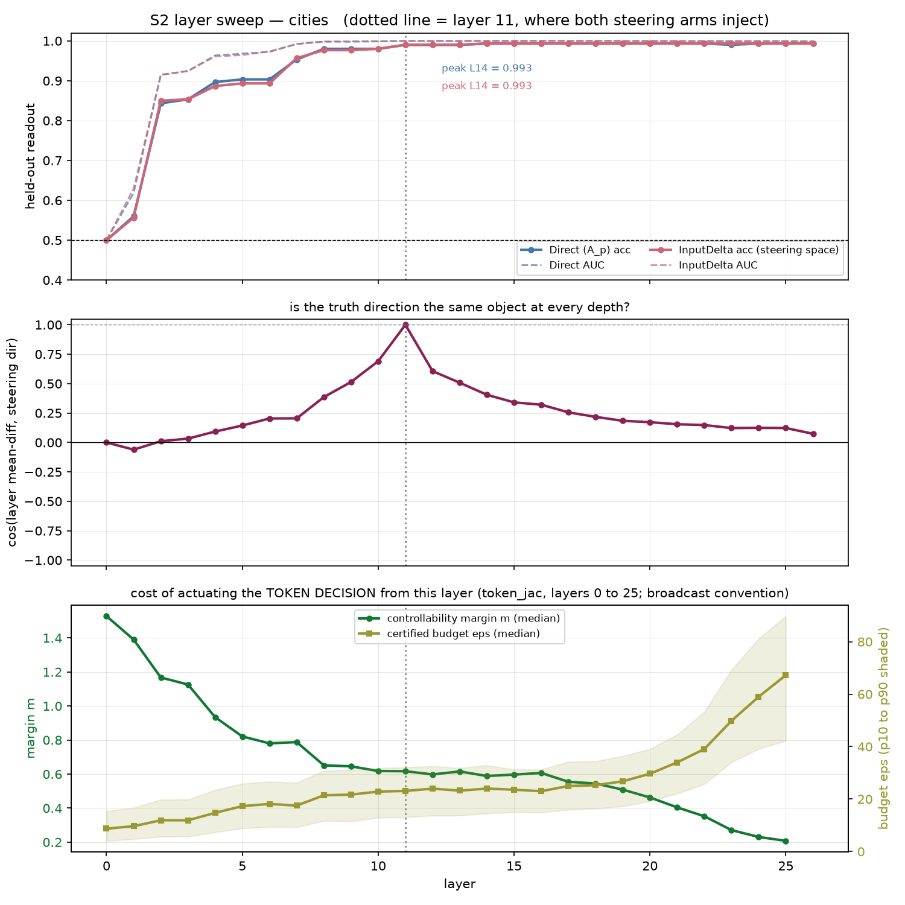
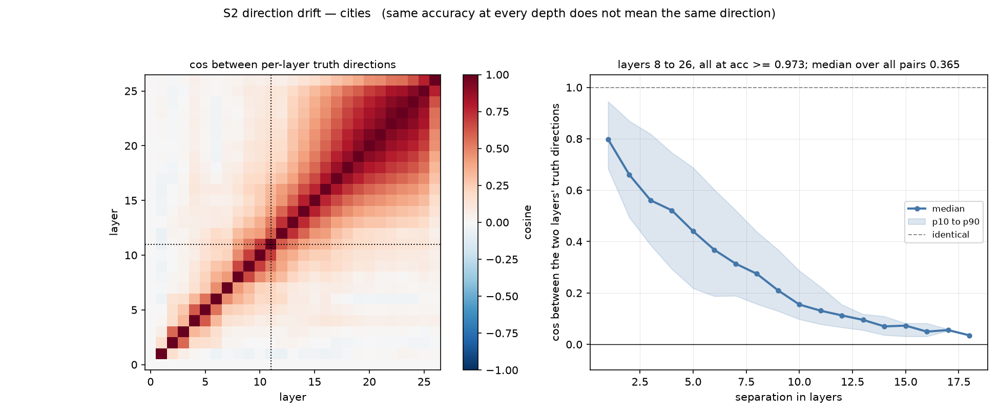

# S2: Layer Sweep of Readout Against Controllability

**Status:** complete, 2026-08-26. CPU only, no GPU, no artifact re-run.
**Design:** section 4 of `docs/superpowers/specs/2026-08-26-steering-validity-audit-design.md`.

---

## 1. Assumption

This is the PI's question, in their words: *sweep over input layers, do the same mapping from
different earlier layers to later, check if same linear relationship and same or different
effects of perturbation on the halfspace metric.*

Stated as a falsifiable proposition: **truth is the same linear object at every depth, so the
layer we chose to steer from is not a meaningful degree of freedom.**

## 2. Prediction, registered before the run

- Readout accuracy rises with depth and saturates in the middle layers.
- The controllability margin behaves oppositely, since `token_jac_{ds}.csv` already showed
  `m_all_median` falling from 1.528 at layer 0.
- The two peaks land in different places, meaning the layer that decodes truth best is not the
  layer from which truth is cheapest to actuate.

## 3. Method

**Command.**

```
./.venv/bin/python src/audit_layer_sweep.py --dataset cities
./.venv/bin/python src/audit_layer_sweep.py --dataset common_claim_true_false
```

Runs in 6 seconds on cities and 25 seconds on common_claim. Nothing about this experiment
needed the cluster: all 27 layers were already sitting in `mag_acts_{ds}.npz`.

**Two feature spaces are swept**, because the project reads truth in one and steers in the
other:

| space | definition | why |
|---|---|---|
| `Direct` | `A_p`, the raw last-token statement activation | the standard geometry-of-truth readout |
| `InputDelta` | `A_Qp - A_p` | the MAG feature `u_Q_gold` was actually built from (`src/mag/directions.py:52`), so it is the only space where a cosine against the real steering vector means anything |

Per layer: 80/20 stratified split at `random_state=42`, `StandardScaler` fit on train only,
`LogisticRegression(max_iter=2000)`, held-out accuracy and ROC AUC. Then the layer's
class-mean-difference direction, its cosine against the steering direction, and the full 27 by
27 cosine matrix between all layers' directions.

**A caveat that must not be skipped when reading panel 3.** The margin `m` and budget `eps` in
`token_jac_{ds}.csv` are computed against the **token decision** readout
`a = W[j_target] - W[j_argmax]`, not against the truth probe. Panels 1 and 2 are about the
truth probe; panel 3 is about the model's next-token choice. That is deliberate, because the
token readout cannot dissociate from behavior (it *is* the behavior at temperature 0), but it
means the two halves of the figure answer "how well can I read truth here" and "how cheaply can
I move the model's decision from here" as **different** questions about the same layer.

`token_jac` also uses the broadcast convention (a vector added at every position). The
per-position number is `eps_last`, reported below alongside it.

## 4. Result



### 4.1 The linear relationship holds almost everywhere, and that is the weak half of the answer

| | cities | common_claim |
|---|---:|---:|
| accuracy at layer 0 | 0.500 | 0.509 |
| first layer within 0.02 of peak | 8 | 12 |
| peak layer and accuracy | 14, 0.993 | 14, 0.728 |
| accuracy at layer 26 | 0.993 | 0.694 |
| accuracy at the injection layer | 0.990 (L11) | 0.704 (L13) |

Truth is linearly decodable from layer 8 onward on cities and it never degrades: 19 consecutive
layers sit between 0.973 and 0.993. The choice of layer 11 costs 0.003 accuracy against the
best available layer. **By the readout criterion the layer choice does not matter,** which is
the answer the question invites and is not the interesting one.

### 4.2 The same accuracy is achieved by different directions



Among the 19 cities layers that all read truth at 0.973 or better, the pairwise cosine between
their mean-difference directions has **median 0.365 and minimum 0.014.** Layers 8 and 26 both
classify truth at 0.99 along directions that are essentially orthogonal.

The left panel shows this is not noise. The matrix is banded: agreement decays smoothly with
separation rather than scattering.

| separation | median cosine, cities | median cosine, common_claim |
|---:|---:|---:|
| 1 layer | 0.798 | 0.881 |
| 5 layers | 0.440 | 0.556 |
| widest | 0.035 (18 apart) | 0.147 (14 apart) |

**The truth direction rotates continuously with depth while the accuracy stays pinned at
ceiling.** Cosine against the layer-11 steering direction runs 0.691 at layer 10, 1.000 at
layer 11 by construction, 0.606 at layer 12, and 0.074 at layer 26.

So the PI's question has a two-part answer. *Is it the same linear relationship?* It is equally
**strong** at every depth past the knee, and it is not the **same** relationship. Any claim of
the form "the truth direction" needs a layer attached to it, and a direction estimated at one
layer is a poor description of the concept ten layers away even though both read it perfectly.

This is the non-identifiability problem showing up in a place we had not looked: not different
methods finding different directions at one layer, but the same method finding different
directions at different layers, all with equal accuracy.

### 4.3 Decodability and controllability run in opposite directions

The prediction is upheld, and the dissociation is sharper than expected.

| quantity | cities | common_claim |
|---|---|---|
| margin `m` peak | layer 0, m = 1.528 | layer 0, m = 1.106 |
| `m` at the injection layer | 0.617 (L11) | 0.580 (L13) |
| `m` at layer 25 | 0.208 | 0.181 |
| `m` fall, layer 0 to 25 | 7.35x | 6.12x |
| cheapest budget `eps_all` | layer 0, 8.73 | layer 0, 2.92 |
| `eps_all` at the injection layer | 23.11 | 5.34 |
| `eps_all` at layer 25 | 67.24 | 19.93 |
| `eps_last` (per position) at the injection layer | 38.95 | 11.20 |
| broadcast gain at the injection layer | 1.69x | 1.92x |

**Layer 0 is the cheapest layer to actuate the model's token decision from, and it carries no
truth information at all** (readout 0.500, chance). Layer 25 carries all of it and costs 7.7
times more to actuate from than layer 0. The two curves are monotone and opposite over the
whole network.

This is the geometric reason the project keeps landing on nulls, stated in one line: **there is
no layer that is both a good place to read truth and a cheap place to move behavior.** The
injection layers were chosen for readout quality, and they sit at roughly a third of layer 0's
controllability.

Note also the broadcast gain of 1.7x to 1.9x at the injection layers. Every budget reported so
far in this project used the broadcast convention, so the honest per-position spend is the
`eps_last` row, which is 1.7x larger on cities.

## 5. Verdict

**On the assumption: refuted, in a way that matters more than expected.**

Truth is *not* the same linear object at every depth. It is an equally decodable object at
every depth past layer 8, along a direction that rotates smoothly and ends up nearly orthogonal
to where it started. Accuracy is flat; geometry is not. Reporting accuracy alone would have
hidden this completely.

The layer choice is therefore a real degree of freedom, but not for the reason the readout
suggests. It trades nothing in decodability and a factor of seven in controllability.

## 6. Consequences

1. **For D1.** Layers 11 and 13 stay as the injection sites, because the point of D1 is to fill
   the unsampled magnitude band on the same axis the committed arms used, and changing the
   layer would confound it. But D1 is now known to be running at roughly one third of the
   available controllability, which is a fact to state in its writeup rather than discover
   afterward.
2. **A cheap follow-on this makes obvious.** If D1's null holds at layer 11, the natural next
   probe is not a bigger magnitude, it is an **earlier** injection layer. Layer 4 has readout
   0.897 on cities, barely below ceiling, at margin 0.93 against layer 11's 0.617, a 1.5x
   controllability gain for 0.09 of accuracy. That experiment did not exist before this sweep.
3. **For any claim about "the truth direction".** It needs a layer attached. The project should
   stop writing the phrase unqualified, including in the existing docs.
4. **Not done here, and worth flagging.** The cosine comparison is between directions in their
   own layer's coordinates. The properly transported comparison, pushing a layer-8 direction
   forward through the network's Jacobian and asking how it aligns at layer 20, is a different
   and stronger test. It is the `alpha^tr` computation already on the project's open list. This
   result raises its priority: if the transported directions agree where the raw ones do not,
   the rotation is bookkeeping, and if they still disagree, the concept genuinely moves.
