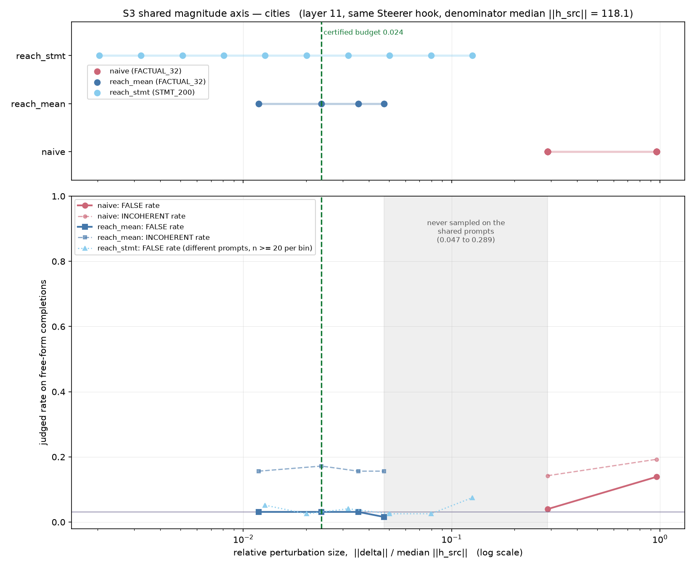

# S3: Both Steering Arms on One Axis

**Status:** complete, 2026-08-26. CPU only, no artifact re-run.
**Design:** section 5 of `docs/superpowers/specs/2026-08-26-steering-validity-audit-design.md`.

**This experiment corrects two findings in its own design spec.** See section 6.

---

## 1. Assumption

The naive and reachability steering results, as reported to date, are comparable, so that
"naive steering fails" and "reachability steering is behaviorally inert" are two conclusions
about one experiment.

## 2. Prediction, registered before the run

They are not comparable. The two swept ranges are disjoint by roughly a factor of 6 on cities,
with the certified budget inside the reachability range and far below every naive point.

## 3. Method

**Command.**

```
./.venv/bin/python src/audit_common_axis.py --dataset cities
./.venv/bin/python src/audit_common_axis.py --dataset common_claim_true_false
```

### 3.1 The comparability preconditions, checked in code rather than assumed

The design spec required confirming these before claiming a shared axis. All three pass.

| precondition | result |
|---|---|
| same injection operator | Both arms steer through `dct_steer_utils.Steerer`, which adds the vector to the **input** of `model.model.layers[L]` on every forward pass and at **every position**. `src/mag/steer.py:71` and `src/reach_steer.py:143` construct it identically. Same broadcast convention. |
| same injection layer | `mag_dir_{ds}.npz["layer"]` equals `dct_meta_{ds}.json["source_layer"]`: 11 on cities, 13 on common_claim. The script raises rather than plotting if they ever differ. |
| same prompts | The naive arm and the reachability **mean** arm both use exactly the 32 `FACTUAL_PROMPTS`, verified as set equality. The reachability **per-statement** arm uses 200 statement stems that share **zero** prompts with those 32. |

The per-statement arm therefore contributes magnitude coverage but its rates are never merged
with the other two. This distinction turns out to matter, and it is where the spec went wrong.

### 3.2 The axis

Neither arm's own normaliser is the activation norm:

| dataset | canonical denominator, median ‖h_src‖ | naive `A_prefix_norm` | reach `input_scale` |
|---|---:|---|---|
| cities | 118.065 | 113.795 (96.4%) | 47.716 (40.4%) |
| common_claim | 151.281 | 118.170 (78.1%) | 86.733 (57.3%) |

All magnitudes below are expressed as `‖delta‖ / median ‖h_src‖` at the injection layer.
Note the 78.1% on common_claim: a "tau = 1.0" perturbation there is 78% of the activation norm,
not 100%, because the naive arm calibrates against a quantity 22% smaller than the state it
perturbs.

The comparable outcome is the judge's verdict on free-form completions: **FALSE rate** (the
model asserts something false) and **INCOHERENT rate**, reported as separate outcomes and never
collapsed.

## 4. Result



### 4.1 Coverage: the arms are disjoint, by less than the spec claimed

| dataset | reach_mean range (shared prompts) | naive range (shared prompts) | gap |
|---|---|---|---:|
| cities | 0.0119 to 0.0475 | 0.2892 to 0.9638 | 6.09x |
| common_claim | 0.0069 to 0.1413 | 0.2343 to 0.7811 | 1.66x |

Including the per-statement arm, which reaches much further but on different prompts:

| dataset | reachability max (any arm) | naive min | verdict |
|---|---:|---:|---|
| cities | 0.1258 | 0.2892 | disjoint, 2.30x |
| common_claim | 0.3520 | 0.2343 | **they overlap** |

The certified budget sits comfortably inside the reachability range on both datasets: 0.0237
on cities and 0.0707 on common_claim.

### 4.2 The reachability arm is inert across its entire range, and the null is clean

Exact counts on the shared 32 prompts, pooling every steered scale against unsteered:

| dataset | unsteered FALSE | all steered scales pooled | Fisher p |
|---|---|---|---:|
| cities | 1 of 32 | 7 of 256 (0.027) | **1.000** |
| common_claim | 2 of 64 | 25 of 512 (0.049) | 0.757 |

On cities the FALSE rate is 0.0312 at **every single swept magnitude**, identical to the
unsteered rate to four decimals, and it is 0.0156 at the largest. This is as flat as a null
gets. On common_claim there is a visible upward drift, 0.031 at the smallest magnitudes to
0.094 at 0.141, but that is **3 completions against 1** and Fisher gives p = 0.61. It is a hint
of where to look, not a result.

### 4.3 The naive arm does move behavior, and the degradation story does not hold up

This is the part that corrects the design spec.

| dataset | magnitude | n | FALSE | rate | p vs unsteered | INCOHERENT | rate | p vs unsteered |
|---|---:|---:|---:|---:|---:|---:|---:|---:|
| cities | rel 0.289 | 576 | 23 | 0.040 | 0.573 | 82 | 0.142 | 0.611 |
| cities | rel 0.964 | 576 | 80 | 0.139 | **1.7e-07** | 111 | 0.193 | 0.222 |
| common_claim | rel 0.234 | 576 | 26 | 0.045 | 0.366 | 100 | 0.174 | 0.563 |
| common_claim | rel 0.781 | 576 | 77 | 0.134 | **4.5e-07** | 114 | 0.198 | 0.162 |

Unsteered baseline on both: 9 FALSE and 45 INCOHERENT of 288.

**At the largest naive magnitude the FALSE rate more than quadruples with p below 2e-7, while
the rise in incoherence is not statistically detectable (p = 0.22 and p = 0.16).** The design
spec's Finding 3 asserted that the large-magnitude flips "co-occur with degradation". On the
free-form judged outcomes that is not supported: the degradation rises from 0.156 to roughly
0.195 and could easily be chance, while the falsehood rate moves from 0.031 to 0.137 and could
not be.

This does not make the naive arm a success. A perturbation of 78% to 96% of the activation norm
producing a 13.7% falsehood rate is not controlled steering. But "it is only breaking the
model" is the wrong description of it, and that description was in our own spec.

### 4.4 Where the transition actually is

Reading the table above in order of magnitude, on the shared prompt set:

| relative magnitude | what is known |
|---|---|
| 0.007 to 0.14 | reachability direction, at baseline, clean null |
| 0.23 to 0.29 | naive directions, **at baseline**, p = 0.37 and 0.57 |
| 0.29 to 0.78 | **nothing has ever been measured here** |
| 0.78 to 0.96 | naive directions, significantly elevated FALSE |

The behavioral transition is bracketed between **0.29 and 0.78**, not near the certified budget
at 0.02 to 0.07. The small-magnitude band is not where the action is; it is where the null is
already well established.

## 5. Verdict

**On the assumption: refuted.** The two arms never sampled a common magnitude on a common
prompt set, so the head to head comparison the PI asked for still has not been performed. The
gap is 6.09x on cities and 1.66x on common_claim.

But the more useful result is the one the shared axis makes visible for the first time: the
reachability arm is inert over 0.007 to 0.14, the naive arm is *also* at baseline over 0.23 to
0.29, and behavior only moves somewhere above 0.29. Two separate experiments each concluded
"no effect" from opposite sides of a band neither of them entered.

## 6. Corrections to the design spec

Recorded here rather than quietly edited, because the spec was committed before this ran.

**Finding 1 was right about cities and overstated for common_claim.** The spec reported the
arms as disjoint by 6.1x and never overlapping. That holds on cities on the shared prompts
(6.09x, confirmed). On common_claim the shared-prompt gap is only 1.66x, and once the
per-statement arm is included the ranges **overlap** (reachability reaches 0.352, naive starts
at 0.234). The spec reached its number by comparing only the mean arm and generalising from
cities.

**Finding 3 is not supported on the judged free-form outcomes.** The claim that large-magnitude
flips co-occur with degradation came from comparing 15.6% incoherence at tau 0 against 21.2% at
tau -1.0, a single signed cell. Pooled by magnitude with an exact test, the incoherence rise is
p = 0.22 on cities and p = 0.16 on common_claim, while the FALSE rise is p < 5e-7 on both.

Both corrections make the naive arm look **better** than the spec claimed, which is the
direction that argues against our own prior conclusion, so it is worth stating plainly rather
than burying.

## 7. Consequence for D1: the grid must change

The design spec's D1 grid was

```
0.005, 0.01, 0.02, 0.035, 0.05, 0.08, 0.12, 0.18, 0.27, 0.40, 0.60, 1.00
```

which puts 8 of 12 points below 0.20 and only 2 points inside the 0.29 to 0.78 band where S3
shows the transition actually lives. That grid was designed to interrogate the certified budget,
before we knew the certified budget region was the well-established part.

**Proposed revised grid**, same 12 points, reweighted:

```
0.01, 0.02, 0.04, 0.08, 0.15, 0.22, 0.30, 0.40, 0.52, 0.66, 0.82, 1.00
```

This keeps 5 points at or below 0.15, which is the range where only the *reachability* direction
has ever been tested and the truth directions have not, and puts 6 points inside 0.22 to 0.82,
where the transition is bracketed. It still contains a point near the cities certified budget
region and a point at each previously sampled naive magnitude for continuity.

Sample size also needs attention. Every rate above rests on 32 prompts per cell, where one
completion is 3.1 percentage points. The reachability arm's apparent common_claim trend is
3 completions against 1. D1 should either increase the prompt count or accept that it can only
resolve effects larger than about 10 percentage points.
