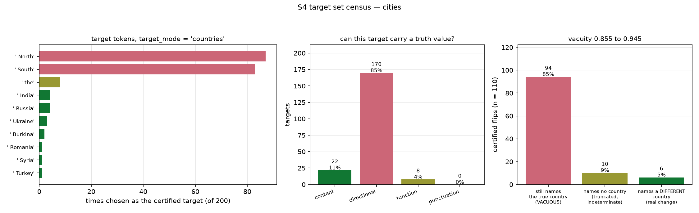

# S4: Target Set Census and Semantic Vacuity Rate

**Status:** census complete for both datasets; deterministic vacuity complete for `cities`;
judge-based vacuity for `common_claim_true_false` **pending** (no `ANTHROPIC_API_KEY` in this
environment). 2026-08-26, CPU only, no artifact re-run.
**Design:** section 6 of `docs/superpowers/specs/2026-08-26-steering-validity-audit-design.md`.

---

## 1. Assumption

The certified target set represents the behavior we care about, namely the model asserting
something false. Hitting the target should therefore mean something.

## 2. Prediction, registered before the run

It does not. 85% of cities targets are already known to be " North" or " South". The vacuity
rate, meaning the fraction of certified argmax flips that leave the claim's truth value
unchanged, is predicted **above 0.8 on cities**.

## 3. Method

**Command.**

```
PYTHONPATH=src ./.venv/bin/python src/audit_target_census.py --dataset cities
PYTHONPATH=src ./.venv/bin/python src/audit_target_census.py --dataset common_claim_true_false
```

**The vacuity test needs no judge on cities, and that is better than judging it.** The dataset
is templated, and `got_datasets/cities.csv` carries `correct_country` for every statement. So
"did the claim's truth value change?" reduces to a string test against ground truth rather than
a model's opinion. Deterministic, auditable, free, and not subject to judge error.

Join path, each link verified rather than assumed: the steer arm's `stmt` is a row index equal
to `token_geom_cities.csv`'s `idx` (set equality holds over all 200), and `token_geom`'s
`statement` joins to `got_datasets/cities.csv` at 100% coverage. The `stem` column is **not** a
valid join key: only 192 of the 200 stems are unique.

Completions are read through `token_conclusions.load_arm`, never a bare `pd.read_csv`.

**Three outcomes, not two.** A first pass classified only "still names the true country" against
"does not". Inspection showed the second bucket contains truncations: an 8-token completion
reading "the northern part of Hebei Province," never reaches "China" but has not become false.
The final classification is:

| outcome | test | meaning |
|---|---|---|
| vacuous | steered completion still names the true country | certified flip, claim unchanged |
| changed | steered completion names a **different** country from the dataset's country list | certified flip, claim now false |
| indeterminate | names no country at all | usually truncation at the 8-token budget |

This makes the lower bound on vacuity honest, and it stops truncation being silently counted as
a steering success.

## 4. Result



### 4.1 The two datasets have different `target_mode` values, and the spec recorded only one

| dataset | `target_mode` | what it means |
|---|---|---|
| `cities` | `countries` | target drawn from country-name tokens |
| `common_claim_true_false` | `runnerup` | **the target IS the second-most-likely token** |

The design spec stated `countries` and generalised. On common_claim the objective never aimed
at falsity at all: it aimed at whatever the model was already second-most likely to say. That
is the minimum-norm principle taken to its conclusion, and it makes the common_claim target set
vacuous by definition rather than by accident.

### 4.2 Census

| | cities | common_claim |
|---|---:|---:|
| distinct target tokens over 200 statements | **16** | 161 |
| top 2 tokens as a share of all targets | **85.0%** | 9.0% |
| content-word targets | 22 (11.0%) | 151 (75.5%) |
| directional targets (North, South, ...) | **170 (85.0%)** | 2 (1.0%) |
| function-word targets | 8 (4.0%) | 36 (18.0%) |
| punctuation targets | 0 | 11 (5.5%) |

On cities, **89% of certified targets are tokens that cannot carry the truth value of the
claim.** " North" was chosen 87 times and " South" 83 times out of 200. Only 22 targets are
content words, and the Wilson interval on that is [0.070, 0.162].

The common_claim census looks healthier by token class, 75.5% content, but that is misleading.
Under `runnerup` mode a content-word target is still by construction the model's own second
choice, which is the smallest semantic step available rather than a step toward falsehood.

**The two datasets fail differently and should not be described with one sentence.** On cities
the objective aimed at countries and minimum norm collapsed it onto country-adjacent modifiers.
On common_claim the objective never aimed at falsity in the first place.

### 4.3 Vacuity on cities: at most 5.5% of certified flips changed the fact

Of 200 statements, 110 named the true country in the unsteered completion. Only those 110 can
demonstrate a steering-induced loss of it; the other 90 never asserted it within the 8-token
budget and are uninformative.

| outcome | n | share of 110 |
|---|---:|---:|
| **vacuous**, still names the true country | 94 | **85.5%** |
| indeterminate, names no country | 10 | 9.1% |
| **changed**, names a different country | **6** | **5.5%** |

- Vacuity rate, lower bound: **0.855**, Wilson 95% [0.775, 0.915]
- Vacuity rate, upper bound: **0.945**, [0.885, 0.980] (counting indeterminate as vacuous)
- Certified flips that demonstrably made the claim false: **6 of 110, or 5.5%**

Recall that `hit_target` is 1.000 at this setting: **200 of 200 argmax flips succeeded.** The
control worked perfectly and the fact moved in at most 6 cases.

Worked examples, all certified successes:

| stem | true country | unsteered | steered | outcome |
|---|---|---|---|---|
| The city of Weifang is in | China | the north of Shandong Province, China. | **North** East China, and is the capital | vacuous |
| The city of Zibo is in | China | the Shandong Province of China. It is | **North** China's North China's | vacuous |
| The city of Dehra Dun is in | India | the state of Uttarakhand, India. It | **North** India, in the state North North | vacuous |
| The city of Mosul is in | Iraq | the north of Iraq, and it is | **Syria**, and it is the largest city | changed |
| The city of Krasnodar is in | Russia | Russia, in the Krasnodar Kra | **Ukraine**, and it is the second largest | changed |
| The city of Langfang is in | China | Hebei province, China. It is | the northern part of Hebei Province, | indeterminate |

The Langfang row is exactly why the three-way split exists. A two-way test would have scored it
as a semantic success; it is a truncated true statement.

### 4.4 What is not measured here

The judge-based vacuity rate for `common_claim_true_false` requires `ANTHROPIC_API_KEY`, which
is not set in this environment, so it did not run. The claims there are free-form and admit no
ground-truth string test, so the census is the whole of what S4 can say about that dataset
without a judge. This is a gap, and it is the only part of Gate 1 that did not complete.

## 5. Verdict

**On the assumption: refuted, decisively, on cities.**

The certified target set does not represent the behavior we care about. Every one of 200
certified argmax flips succeeded, the text stayed fluent, and between 85.5% and 94.5% of them
left the claim's truth value untouched. At most 5.5% produced a false assertion.

The mechanism named in the design spec is confirmed by the census: minimum norm is adversarial
to semantics. The cheapest face of the argmax cone is the token the model was already nearly
going to emit, so " North" is cheap precisely because "North East China" was already plausible.
The optimiser did exactly what it was asked and the request was wrong.

This is the strongest single result in Gate 1, and it is the good kind of negative result: the
control theory works, the certificate is tight, the perturbation is benign to fluency, and the
defect is entirely in how the target region was specified. That is a fixable problem, which is
what T1 exists to test.

## 6. Consequences for T1

1. **The stoplist is now empirical rather than guessed.** The design spec proposed excluding
   North, South, East, West and function words. The census says that removes 178 of 200 cities
   targets (85% directional plus 4% function), so the restricted problem is a genuinely
   different problem, not a tweak. Expect the budget ratio to be substantial.
2. **The success criterion is now calibrated.** T1 has to beat 5.5%. Anything below roughly 20%
   of certified flips producing a real falsehood would not be worth reporting as a fix.
3. **The denominator problem must be fixed too.** Only 110 of 200 statements named the true
   country when unsteered, so 45% of the certified set cannot demonstrate anything either way
   at an 8-token budget. T1 should either extend the generation budget or restrict to
   statements whose unsteered completion asserts the fact.
4. **common_claim needs a different target mode before T1 can touch it.** `runnerup` is not a
   truth-related objective at all. The spec's decision to start with cities only is correct,
   and the reason is now stronger than "the allowed set is harder to define".
